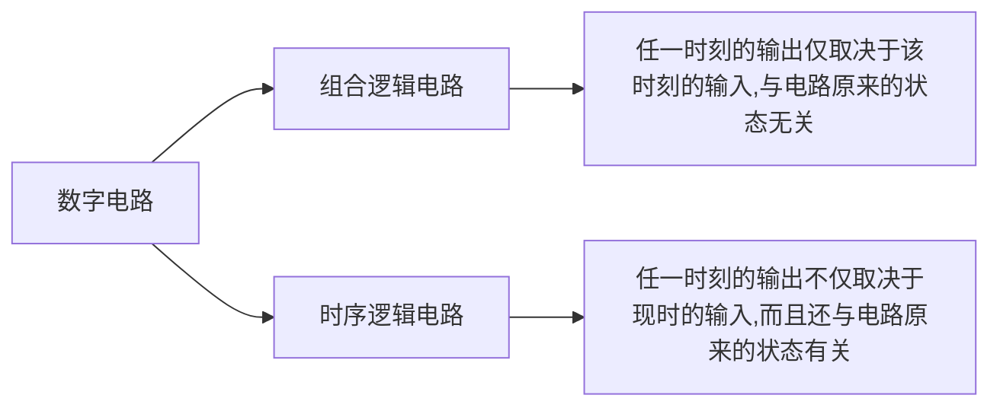

# 1绪论

## 相关课程&#x20;

MIT，EECS，6004

Berkeley2，EE，CS150

## 1.什么是数字电路Digital Circuit？

### 1.概念

用数字信号完成对数字量进行算数运算和逻辑运算的电路称之为数字电路，或书仔细听，由于它具有逻辑运算和逻辑处理功能，所以又称数字逻辑电路

数字信号：指用二进制表示的信号，高电平表示1，低电平表示0

### 2.历史

1948 贝尔实验室William Shockiey制成第一个晶体管

1958 Jack Kilby集成电路

1969 大规模集成电

1975 超大规模集成电路

### 3.分类

# 2.数制与码

### 2.1概念

概述：描述数字电路所处理的各种数字信号都是以数码形式给出的，用数码去表示数量大小时，采用的各种计数进位制规则称之为数制

数码：是一种**符号**，例如十位数中有十个数码0-9，二进制中有两个数码0-1

进位制：多位数码每一位的构成以及从低位到高位的进制规则

基数：数制所使用数码的**个数**

位权：在某一进位制的数中，每一位的大小都对应着该位上的数码乘上一个**固定的数**，这个数就是这一位的位权

### 2.2常用的进制

| 十进制     | 二进制    | 八进制   | 十六进制        |
| ------- | ------ | ----- | ----------- |
| Decimal | Binary | Octal | Hexadecimal |

## 2.3编码

### 1.概念

用二进制数表示各种数字或符号的过程称为编码

### 2.什么是原码、反码和补码？

正数的反码和补码都保持不变

负数的反码：保持符号位不变，其他位取反

负数的补码：是负数的反码加一

### 3.常见的编码

| 十进制数 | 8421BCD码 | 2421BCD码 | 5421BCD码 | 余3位  |
| ---- | -------- | -------- | -------- | ---- |
| 0    | 0000     | 0000     | 0000     | 0011 |
| 1    | 0001     | 0001     | 0001     | 0100 |
| 2    | 0010     | 0011     | 0011     | 0110 |
| 3    | 0011     | 0100     | 0100     | 0111 |
| 4    | 0100     | 0100     | 0100     | 0111 |
| 5    | 0101     | 1000     | 1011     | 1000 |
| 6    | 0110     | 1001     | 1100     | 1001 |
| 7    | 0111     | 1010     | 1101     | 1010 |
| 8    | 1000     | 1011     | 1110     | 1011 |
| 9    | 1001     | 1100     | 1111     | 1100 |
| 权    | 8、4、2、1  | 2、4、2、1  | 5、4、2、1  | 无权   |

余3码：是在8421基础上加+3

### 4.格雷码（Gray Code）

两个相邻代码之间仅有1位数码不同的无权码称之为格雷码

### 5.奇偶校验码

通过在编码中增加一位校验位来使编码中1的个数为奇数或者偶数，校验位可以在原编码的前面或者后面加。通过加入校验位后的1个数是奇数还是偶数，可分为两种： &#x20;
奇校验：1的个数为奇数 &#x20;
偶校验：1的个数为偶数 &#x20;
下图为奇校验和偶校验的设置方法。

# 3 逻辑电路

## 3.1 基本的门电路（GateCircuit）

概念：用以实现基本逻辑和复合逻辑运算的单元电路称为门电路，或逻辑门

正逻辑：用高电平表示逻辑1，低电平表示逻辑0

负逻辑：用低电平表示逻辑1，用高电平表示逻辑0

#### 1.与门（AND gate）·

#### 2.或门（OR gate）+

#### 3.非门（NOT gate）

### 4.或非门

### 5.与非门

### 6.异或

### 7.同或

## 3.2 逻辑代数

### 3.2.1 反函数和对偶函数

### 3.2.2 基本代数公式

### 3.2.3逻辑化简法

#### 代数化简法

#### 卡诺图化简法

# 4 组合逻辑电路

**常见的组合逻辑电路模块及应用**

## 4.1 组合逻辑电路的分析方法

分析方法步骤:

## 4.2 组合逻辑电路的设计

1. 根据实际逻辑问题的因果关系确定输入、输出变量，并定义逻辑状态（0、1）的含义

2. 根据逻辑功能的描述列出真值表

3. 由真值表写出逻辑表达式

4. 简化和变换逻辑表达式，画逻辑图

### 竞争冒险现象及成因

* 竞争： 在组合电路中，信号经由不同的路径到达某一会合点的时间有先有后的现象。

* 冒险：由于竞争而引起电路输出发生瞬间错误。表现为输出端出现了原设计中没有的窄脉冲（毛刺）。

## 4.3 编码器（Encoder）

编码: 为了区别一系列不同的事物，用一个二进制代码表示特定含义的信息称为编码

编码器: 具有编码功能的逻辑电路

编码器的逻辑功能：能将每一个需要编码的输入信号变换为不同的二进制的代码输出

### 4.3.1 编码器的分类

* 普通编码器：任何时候只允许输入一个有效的编码信号，否则就会出现混乱

* 优先编码器：允许同时输入两个以上额有效编码信号。当同时输入几个有效编码信号时，优先编码器能按预先设定的优先级别，只对其中优先权最高的一个进行编码

* 集成编码器

| 常用集成编码器 | 描述                          | 输入信号  | 输出信号  |
| ------- | --------------------------- | ----- | ----- |
| 74X147  | 10-4 BCD码编码器,是一种2-10进制优先编码器 | 低电平有效 | BCD码  |
| 74X148  | 8-3 优先编码器,                  | 低电平有效 | 二进制代码 |
| CD4532  | 8-3优先编码器                    | 高电平有效 | 二进制代码 |

### 4.3.2 74X148原理

74LS148 为TTL电路；74HC148为CMOS电路，二者电性能参数不同但逻辑功能相同

输出值的计算:设最优先输入有效端为in,输出值为x，D(7-n) → B(x)

反码形式：假设对`i7` 非编码，原码输出111，反码输出为000

`i7`到`i0` 优先级依次递减

**对输出状态都为111的描述:**

1. 当编码器的输入使能端`EI非`为1时,无论输入何值，所有的输出端均为高电平，即禁止编码器工作

2. 当编码器的输入使能端`EI非`为0时:

    1. 若所有输入为高电平,输出也都为高电平,且触发输出使能和扩展输出工作.此时表明编码器处于工作状态，但`i7非`到`i0非`这八个输入信号无效状态,此时合江EO这个输出端连接到另一片74LS148的`EI`端以便级联，组成输入端的优先编码器

    2. 若`GS`=0,`EO`=1;表示输入信号中至少有一个输入是有效的,为0;

### 4.3.3 级联组成16-4线 优先编码器

## 4.4 译码器

译码：译码是编码的逆过程，它能将二进制码翻译成代表某种特定含义的信号（即电路的某种状态）。

译码器：具有译码功能的逻辑电路称为译码器。

唯一地址译码器：将输入代码转换成与之对应的唯一有效信号。

代码转换器：将一种代码转换成另一种代码

### 4.4.1 译码器的分类

* 二进制译码器

* 二-十进制译码器

* 显示译码器

### 4.4.2 74HC138的原理

### 4.4.3 74HC138的应用

74HC138可以实现各种组合逻辑电路

74HC138提供了3变量所有最小项的非值，而任何组合逻辑函数均可由若干最小项**或组成**，利用74138提供最小项很方便实现组合逻辑功能。

**例题**

### 4.4.4  典型译码器电路及应用

LE：锁存使能段

## 4.5 数据选择器

数据选择器：能实现数据选择功能的逻辑电路。它的作用相当于多个输入的单刀多掷开关，又称"多路开关"。

数据选择的功能：在通道选择信号的作用下，将多个通道的数据分时传到公共的数据通道上去

### 4.5.1 数据选择器的功能与定义

**二选一数据选择器**

| 选择输入（S） | 输出（Y） |
| ------- | ----- |
| 0       | D0    |
| 1       | D1    |

**四选一数据选择器**

### 4.5.2 数据选择器的应用

### 4.5.3  集成电路数据选择器

# 5 锁存器和触发器

锁存器是一种对脉冲电平敏感的双稳态电路

锁存器（Latch）是一种对脉冲电平敏感的双稳态电路，一旦状态被确定就能自行保存，直到有外部输入脉冲信号的作用，才有可能改变状态。这种特性可以用于存储1位二进制数据，在单片机中可以存储地址。

## 5.1 SR锁存器

时序电路：时序逻辑电路由进行逻辑运算的组合电路和起记忆作用的存储电路组成；电路的输出信号和状态信号决定。

### 5.1.1 基本双稳态电路

双稳态的概念：只有两种稳定的状态(0,1),在外作用下，可以从一个稳定状态变化到另一个稳定状态。

### 5.1.2 基本ＳＲ锁存

**例题**

r=0 ,s=1 → Q set 1

r=1 ,s=0 → Q set 0&#x20;

r=0 ,s=0 → Q keep&#x20;

r=1 ,s=1 → Q、¬Ｑ set 0&#x20;

→ keep random next

### 5.1.3 逻辑门控SR锁存器

## 5.2 D锁存器

D锁存器是在逻辑门控SR锁存器的两个输入端的之间加了一个非门，保证了锁存器不存在不允许的状态

#### 5.2.1 逻辑门控锁存器

#### 5.2.2 传输门控锁存器

`TG1` 表示传输门，当c=1，c非=0,`TG1` 导通

* E=1 → C=1 ,`TG1`导通，`TG2` 断开

* Q=D

* E=0 → C=0，`TG1`导通，`TG2`断开

* Q保持不变

## 5.3 触发器

### 5.3.1 锁存器概述

**触发器与锁存器的比较**

* 共同点：

  * 具有0和1两个稳定状态，一旦状态被确定，就能自行保持。一个锁存器或触发器能存储一个二进制码。

* 不同点：

  * 锁存器：对脉冲电平敏感的存储电路，在特定输入脉冲电平作用下改变状态。

  * 触发器：对脉冲边沿铭感的存储电路，在时钟脉冲的上升沿或下降沿的变化瞬间改变状态。

* 触发器逻辑功能：次态与现态、输入信号之间的逻辑关系。

    触发器的次态不仅仅与当前输入信号有关，而且与当前状态有关。

* 触发器逻辑功能描述：特性表、特征方程、状态图、波形图

* 按照触发器逻辑功能，通常分为D、JK、T、SR触发器

    

    $$
    Q^{n+1}=D
    $$

### 5.3.2 D触发器(Data)

### 5.3.3 JK触发器

### 5.3.4 T触发器(Toggle)

用于反转、计数

&#x20;

### 5.5.4 SR触发器

### 5.3.5 各类触发器的功能表

# &#x20;6 时序逻辑电路

## 6.1 时序逻辑电路概述

结构特征:

* 电路由组合电路和存储电路组成

* 电路的输出信号由输入信号和状态信号决定

### 6.1.1方程组的表示方式

输出方程:$  O=f(I,S)$
$ 表达\color{red}输出信号与输入信号、状态变量\color{black}的关系式  $

激励方程:$ E=g(I,S) $
$ 表达\color {red}激励方程与输入信号、状态变量\color{black}的关系式$

状态方程:$ S^{n+1}=h(E,S^n) $
$ 表达了存储电路从\color{red}现态到次态\color{black}的转换关系式 $

**下图是一个由D触发器和与门组成时序逻辑电路**

### 6.1.2转换表表示方式

* 状态转换真值表

* 转换表与状态表(常用)

* 状态图

1. 用一个圆框住所有的状态变量,箭头外指,并指明跳转条件,A是输入,Y是输出

2. 如图,当状态是`11` 时,跳转到`00` ,

    需要先跳转到`10` ,跳转条件是`A=0`&#x20;

    再跳转到`00`,跳转条件是 `A=1`

### 6.1.3时序逻辑电路分类

**按时钟控制方式可分为:**

1. 同步时序电路

    各触发器共用一个时钟CP,触发器的状态在同一时刻更新.

2. 异步时序电路

    没有统一的时钟脉冲或没有时钟脉冲,电路的状态更新不是同时发生.

**按输出信号特性可分为**

1. 米利型: 输出信号是输入信号与状态信号的函数

2. 穆尔型:输出信号是状态信号的函数

## 6.2 同步时序逻辑电路的分析

### 6.2.1分析的一般步骤

1. 确定电路的输入、输出信号、触发器的类型等.

2. 写出下列各逻辑方程组

    1. 列出输出方程组

    2. 列出激励方程组

    3. 列出状态方程组

3. 写出电路的状态表、画出状态图,伙伴拟定一典型输入序列画出时序图.

4. 确定电路的逻辑功能,描述其功能

[同步时许逻辑电路例题](同步时许逻辑电路例题/同步时许逻辑电路例题.md "同步时许逻辑电路例题")

## 6.3 同步时序逻辑电路的设计

### 6.3.1设计要求

**任务:**

&#x20;根据实际逻辑问题的要求,设计出能实现给定逻辑功能的电路.

**设计目标:**

使用尽可能少的触发器和逻辑门实现预定逻辑功能

**设计的一般要求:**

### 6.3.2触发器的激励表  &#x20;

&#x20;触发器的激励表把现态和次态当作自变量，把触发器的输入当作因变量。激励表可以从功能表导出

| D |  $ Q^{n+1} $ | 功能 |
| - | -------------- | --  |
| 0 | 0              | 置0 |
| 1 | 1              | 置1 |

| Q |  $ Q^{n=1} $  | D |
| - | ------------- | - |
| 0 | 0             | 0 |
| 0 | 1             | 1 |
| 1 | 0             | 0 |
| 1 | 1             | 1 |

可以看出D= Qn+1，在用D触发器设计时序电路时，对应触发器状态表达式和激励表达式是一致的。

[D触发器设计842BCD码同步十进制加计数器](D触发器设计842BCD码同步十进制加计数器/D触发器设计842BCD码同步十进制加计数器.md "D触发器设计842BCD码同步十进制加计数器")

## 6.4 寄存器和移位寄存器

### 6.4.1寄存器

**寄存器**：是数字系统中用来存储代码或数据的逻辑部件。它的主要组成部分是触发器。

一个触发器能存储1位二进制代码，存储 n 位二进制代码的寄存器需要用 n 个触发器组成。寄存器实际上是若干触发器的集合。

一般，寄存器比锁存器具有更好的同步性能和抗干扰性能

#### 74HC374内部结构和逻辑功能

存入: 将欲保存的数据给到D0\~D7 ，CP↑ 即可存入。

读取: 通过Q0\~Q7来读取寄存器数据。

### 6.4.2移位寄存器

逻辑功能:

&#x20; 移位寄存器是既能寄存数码，又能在时钟脉冲的作用下使数码向高位或向低位移动的逻辑功能部件。
国家标准规定：逻辑图中低位到高位排列是从左至右。
右移：数据从低到高；左移：数据从高到低

逻辑功能分类:

电路:

工作原理:&#x20;

当上升沿的信号一旦到来,四个触发器同时刷新状态

#### 74HC164

### 6.4.3多功能双向移位器

工作原理:
双向移位寄存器：数据既可以右移，低→高；也可以左移，高→低。
多功能指还具有其他功能，如并行输入、输出等。
多功能移位寄存器工作模式如图:

#### 74HC194

## 6.5 计数器&#x20;

&#x20;计数器的功能是对脉冲计数，应用中还常用作定时、分频、产生节拍脉冲和脉冲序列及进行数字运算等等。

1. 概念

    * 计数器的“数”  ——触发器的状态组合表示，在计数脉冲作用下使一组触发器的状态依次转换成不同的状态组合来表示数的变化。

    * 计数器的“模”  ——一次循环所包含的状态总数。

2. 分类

### 6.5.1二进制计数器

#### 异步二进制计数器

### 6.5.2同步二进制计数器

特点:

&#x20;     计数脉冲作为时钟信号同时接入各触发器的时钟输入端。当计数脉冲到来时，所有该翻转的触发器同时翻转，而保持不变的触发器保持状态不变。     &#x20;

&#x20;    同步计数器的每一个触发器相对于计数脉冲都只有1tpd的延时，不存在异步计数器进位造成的延时时间积累，所以能取得较高的计数速度

### 6.5.3集成计数器

#### 74LVC161

#### 用集成计数器构成任意进制计数器

&#x20;用M进制计数器外加适当的逻辑电路构成N进制计数器。

1. 反馈清0法——适用于具有清0输入端的集成计数器

    * **异步清0**：清0输入端输入有效电平，触发器即清0。

        构成N进制计数器时，可在最后一个状态之后的状态通过译码产生一个清0信号进行清0 。

    * **同步清0**：清0输入端输入有效电平，下一个CP有效沿到来后清0。

        构成N进制计数器时，由最后一个状态通过译码产生一个清0信号。&#x20;

2. 反馈置数法——适用于具有预置功能的集成计数器

    在计数过程中，将计数器输出的任意一个状态通过译码，产生一个预置控制信号至预置控制端，在下一个脉冲作用后，将预置数据置入计数器

[用74LVC161构成九进制加计数器](用74LVC161构成九进制加计数器/用74LVC161构成九进制加计数器.md " 用74LVC161构成九进制加计数器")

# 7 半导体存储器

**半导体存储器**:存放大量二进制信息的半导体器件

存储器的主要性能指标:

1. 存储数据量大——存储容量大

2. 取速度快——存储时间短

**可编程逻辑器件**：是一种通用器件，其逻辑功能是由用户通过对器件的编程来设定的。它具有集成度高、结构灵活、处理速度快、可靠性高等优点。

**基本概念**

字长: 数据通路的宽度,表示一个信息的多位二进制码称为一个字,字的位数成为字长

字数:字的总量.字数=$ 2^n
  $（n为存储器外部地址线的线数）

地址：每个字的编号。

存储容量（M）：存储二值信息的总量。

存储容量（M）＝字数×位数

## 7.1只读存储器(ROM)

定义:(Read-Only Memory)只读存储器,工作时只能读出,不能随时写入,所以称作只读存储器.(实际不)

### 7.1.1.二极管PROM原理

### 7.1.2 两维译码

交点处有MOS管相当于存0,无MOS管相当于存1

### 7.1.3 可编程EPROM

### 7.1.4 集成电路ROM

### 7.1.5 ROM的读操作与时序图

### 7.1.6 ROM的应用举例

## 7.2 随机存储器(RAM)&#x20;
